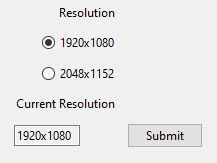
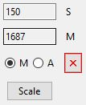
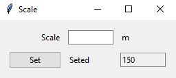
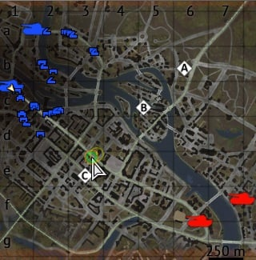
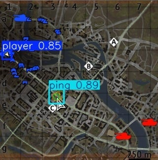

# 🛰️ Map Rangefinder for War Thunder

This project is a **Map Rangefinder tool** designed for **War Thunder**, allowing automatic distance calculation between the **player’s position** and a **map marker** generated where the user clicks on the in-game minimap (located in the bottom-left corner, not the full map opened with the *M* key).  
Additionally, this project should **be compatible with Linux systems** — although it was **fully tested and developed on Windows**.

The tool uses a **YOLOv8 neural network** for on-screen object detection and combines it with **pixel-to-meter calibration** to provide **real-time distance measurements** inside the game.

---

## ⚙️ How It Works

1. The user runs the program and selects their **screen resolution**.  
2. When the user **presses `Alt + Left Mouse Button`** inside the minimap area, a **screenshot** of the minimap is taken and a **marker** is generated at the click location.  
3. The **YOLOv8 model** detects both the **player** and the **marker** on the captured image.  
4. The **pixel-per-square value** (minimap scale) must be **manually entered by the user** once, and is then used for automatic distance calculations.  
5. The **distance in meters** is displayed in a small **in-game overlay (Tkinter UI)**.

---

## 🧠 Technologies

- 🐍 **Python 3.10+**  
- 🤖 **YOLOv8 (Ultralytics)** — object detection model  
- 🪟 **Tkinter** — for the in-game overlay / UI  
- 🧵 **Threading** — to run backend and UI concurrently  
- 🎥 **OpenCV** — for frame capture and preprocessing  

---

## 🚀 Usage for Windows

1. **Download Python** and during installation select **"Add Python to PATH"**, or add it manually to your environment variables later.

2. **Install all dependencies:**
   ```bash
   pip install -r requirments/requirmentsWindows.txt

3. **Run the program**
    ```bash
    python main.py

4. **Select your current game resolution** and click **Submit**.  
   - If your resolution is not listed, please **create a pull request** and send a **print screen of your game with minimap including the scale bar** so it can be added.

5. The in-game UI (overlay) will appear — it is **hoverable**.  
   - Click the **M** button to open the **manual scale input** window.

6. **Enter the current minimap scale** (only the numeric value, without "m" or "meters").

7. Click **Set** to confirm the scale.

8. In-game, **press `Alt + Left Mouse Button`** on the **minimap** (bottom-left corner of the game interface).  
   - After a short moment, the **distance in meters** should appear on the UI.  
   - **Note:** The map resolution must be set to the default size (100%).
   - **Recommended:** works great with squadron and map pings.

## ⚙️ How It Works

When using the Map Rangefinder:

1. **Settings with resolutions:** Choose your current game resolution and submit.  
   

2. **In-game UI:** The overlay appears and is **hoverable**.  
   

3. **Insert scale:** Open manual scale input (press **M**) and enter the minimap scale.  
   

4. **User interaction:** Press `Alt + Left Mouse Button` on the minimap (bottom-left corner).  
   

5. **YOLO detection:** The neural network analyzes the screenshot to detect both the **player** and the **marker**.  
   

## plans for future

implement automatic scale detection which will be requiring pytesseract ocr and cv2 thresholding 
improve threading to hybrid aproach ThreadPoolExecutor + Queue

## ⚠️ Disclaimer

This tool is **not affiliated** with Gaijin Entertainment or War Thunder.  
It is a **personal project**.
