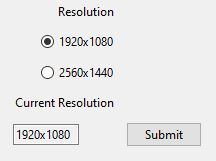
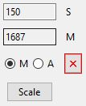
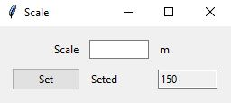
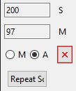
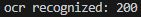
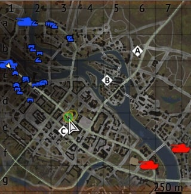
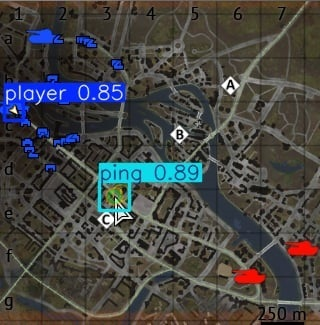

# 🛰️ Map Rangefinder for War Thunder

This project is a **Map Rangefinder tool** designed for **War Thunder**, allowing automatic distance calculation between the **player’s position** and a **map marker** generated where the user clicks on the **in-game minimap** (bottom-right corner **not** the full map opened with the `M` key).

The project is intended to be **compatible with Linux systems**, as it mainly relies on **OpenCV** and **Tesseract OCR**.  
However, it was **fully developed and tested on Windows**.

The tool uses a **YOLOv8 neural network** for on-screen object detection and combines it with **pixel-to-meter calibration** to provide **real-time distance measurements** directly inside the game.

---

## ⚙️ How It Works (Short Overview)

1. The user runs the program and selects their **screen resolution**.  
2. When the user **presses `Alt + Left Mouse Button`** inside the minimap area, a **screenshot** of the minimap is captured and a **marker** is generated at the click location.  
3. The **YOLOv8 model** detects both the **player position** and the **marker** on the captured image.  
4. The **pixels-per-square value** (minimap scale) must be **manually entered once** and is then reused for automatic distance calculations.  
   - Alternatively, **Automatic mode** can be used, which requires **Tesseract OCR**.  
5. The calculated **distance in meters** is displayed in a small **in-game overlay (Tkinter UI)** and is **!!!hoverable!!!**

---

## 🧠 Technologies

- 🐍 **Python 3.10+**  
- 🤖 **YOLOv8 (Ultralytics)** — object detection model  
- 🖼️ **Tkinter** — in-game overlay / UI  
- 🧵 **Threading** — concurrent backend processing and UI  
- 🎥 **OpenCV** — frame capture and image preprocessing  
- 🔎 **Tesseract OCR** — automatic minimap scale detection  

---

## 🚀 Usage (Windows)

1. **Install Python**  
   During installation, select **"Add Python to PATH"** (or add it manually later).

2. **Install dependencies**
   ```bash
   pip install -r requirments/requirmentsWindows.txt

3. **Run the program**
    ```bash
    python main.py

4. **Select your current game resolution** and click **Submit**.  
   - If your resolution is not listed, please **create a pull request** and send a **print screen of your game with minimap including the scale bar** so it can be added in the future.

5. The in-game UI (overlay) will appear and is **!!!hoverable!!!**.  

   - Click the **M** button to select **Manual** mode, then click **Set** to open the **manual scale setting** window.  
   - Click the **A** button to select **Automatic** mode. This requires **Tesseract OCR**, which can be downloaded from:  
     https://tesseract-ocr.com/#download  
   - After installation in this directory, or add Tesseract to the system path:  
     `C:\Program Files\Tesseract-OCR\` (or ensure it is added to **PATH**).

6. **Enter the current minimap scale (M)** (only the numeric value, without "m" or "meters").

7. Click **Set (M)** to confirm the scale. 

8. **Automatic Measurement (A)**  
   If **Tesseract OCR** is installed, all you need is a previously captured minimap screenshot.  
   - Press **Repeat Scale (A)** to perform the automatic measurement using the existing screenshot.

9. In-game, **press `Alt + Left Mouse Button`** on the **minimap** (bottom-right corner of the game interface).  
   - After a short moment, the **distance in meters** should appear on the UI.  
   - **Note:** The map resolution must be set to the default size (100%) in the future will be migrated to (130%).
   - **Recommended:** works great with squadron and map pings.

## ⚙️ How It Works 

When using the Map Rangefinder:

1. **Settings with resolutions:** Select your current game resolution and click **Submit**.  
   

2. **In-game UI:** The overlay appears and is **!!!hoverable!!!** to activate Manual mode click button **M** alternatively to activate Automatic press **A** (requires downloaded **Tesseract OCR**).  
   

3. **Insert scale - Manual Setup (M):** for **M** Enter your map scale using **numbers** only then click **Set**  
   

4. **Automatic Mode – OCR Setup (A)**  
   To use **Automatic mode (A)**, download **Tesseract OCR** from:  
   https://tesseract-ocr.com/#download  

   After installation, either:  
   - place Tesseract in the project directory, **or**  
   - add it to the system **PATH**.  

   > ⚠️ If Tesseract is not in the PATH, the installation directory must match (the default download route):
     ```
     C:\Program Files\Tesseract-OCR\
     ```
   

5. **Automatic Scale Detection (A)**  
   In **Automatic mode (A)**, press **Repeat Scale**.  
   The program will screenshot area of map apply **image thresholding** **Gaussian blur** and **morhgological transform** to the minimap scale area.

   

6. **OCR Processing (A)**  
   The OCR engine automatically scans the detected scale region and attempts to extract the numeric value.  
   - Icons, enemy markers, or ally indicators may interfere with detection and affect OCR accuracy.
 
   


7. **User interaction:** Press `Alt + Left Mouse Button` on the minimap (**bottom-right corner**) area of the minimap will then be captured as a screenshot.

   

8. **YOLO detection:** The neural network analyzes the screenshot to detect both the **player** and the **marker** and the calculated distance will be displayed on the overlay.

   

## plans for future

improve threading to hybrid aproach ThreadPoolExecutor + Queue
and posibly move from notepads to redis , multiprocessing only for yolo rather then threads


## ⚠️ Disclaimer

This tool is **not affiliated** with Gaijin Entertainment or War Thunder.  
It is a **personal project**.

For the tool to work correctly, the game must be set to **Borderless Windowed mode** in the graphics settings.